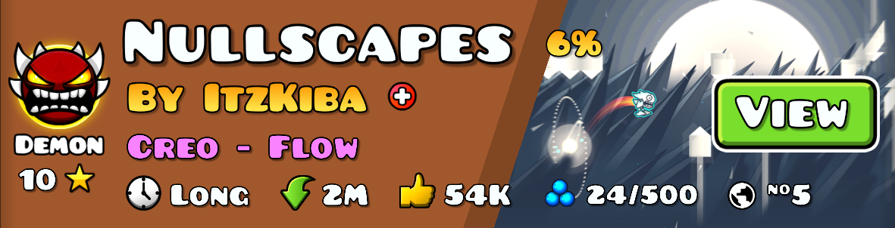
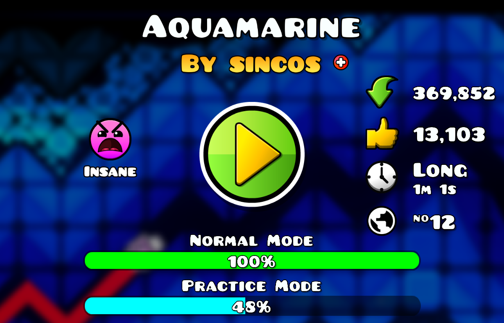
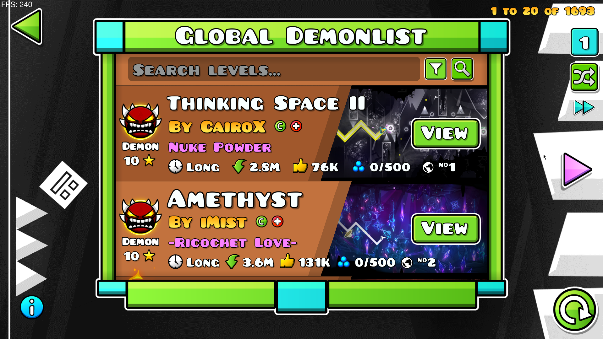

# Global List Integration
This mod adds some <b>features</b> from [demonlist.org](https://demonlist.org) to GD.

## Mod Features:
- Adds the <b>level placement</b> from the <b>Global List</b> to the level info.
- Adds an <b>in-game demonlist</b> on search menu.

# Special Thanks
- hiimjasmine00 (An in-game demonlist was created based on her mod <b>Integrated DemonList</b>)
- Erymanthus (Suggested improvements to my sh**ty code =3)

# Support
Discord: lisenok1042
